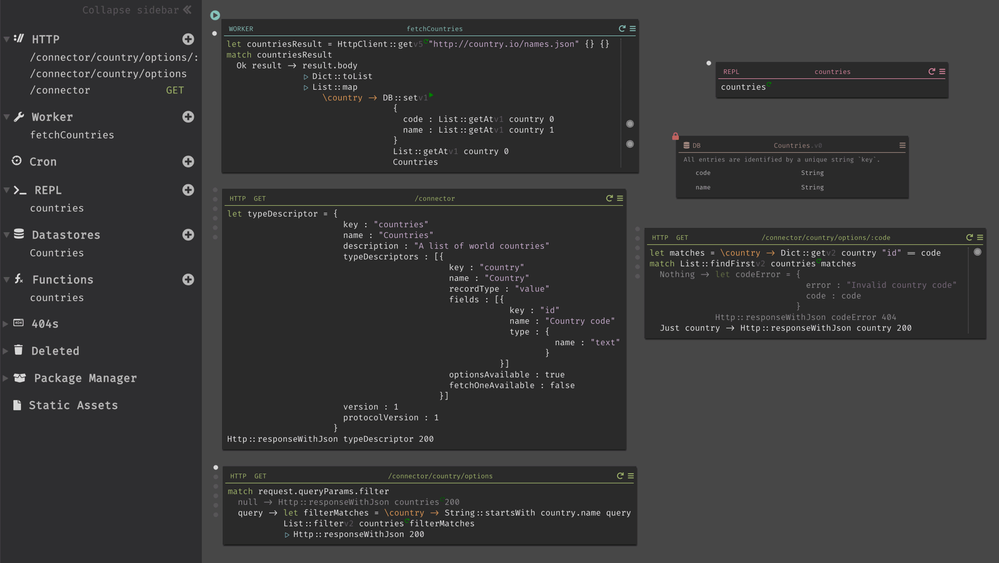

# Java examples

This package provides examples for connectors written in [Dark](https://darklang.com).

## [Country names](countries)

This example demonstrates a simple data source that provides a list of country names, by proxying [Country.io](http://country.io/data/).

